Análise de Dados com o Software R: Métodos Estatísticos, Computacionais e Econométricos
========================================================
author: João Pedro Albino
date: 24 de outubro de 2018
autosize: true

Introdução
========================================================

- A evolução das TICs produziram uma enorme quantidade de dados
- O grande volume de dados tem originado novos conceitos, novas profissões _data scientists_ e novos termos


Novos Conceitos
========================================================

- Novo conceito/termo: _Big Data_
- Outro novo conceito: **Ciência de Dados** 
   - Estudo e geração de conhecimento a partir destes grandes volumes de dados. 
   - Incorpora técnicas e teorias das mais diversas áreas de conhecimento como computação, engenharia, matemática
   - Combina habilidades estatísticas e quantitativas avançadas com a capacidade de programação do mundo real. 
   - Linguagens de programação para desenvolvimento de projetos em ciência de dados
     - _Python_, _Scala_, _Julia_ elinguagem _R_.

Novos Conceitos
========================================================
- **Proof of Concept (PoC)** : Prova de Conceito
- Demonstração de técnica, método, teoria
- Propósito: 
   - _verificar se conceitos ou teorias têm potencial para aplicação no mundo real_


Objetivos
========================================================

- Apresentar e discutir alguns conceitos sobre ciência de dados e _prova de conceito_ (**POC**)
- Base para projeto de análise de dados utilizando a _linguagem R_ 
- Determinar a viabilidade prática do processo
- Demonstrar método permite descobrir informações úteis, gerar conclusões e apoiar o ensino por meio da linguagem R
- Utilizaremos o método proposto em Judd et. ali. (2017) 
- Análise, inspeção, limpeza, transformação e modelagem de dados

Fundamentação Teórica: Prova de Conceito (PoC)
========================================================

- Um modelo prático para provar um conceito teórico estabelecido por uma pesquisa ou artigo técnico
- É uma demonstração, para verificar se determinados conceitos ou teorias têm potencial para aplicação no mundo real
- Uma POC é um _protótipo_ projetado para determinar a viabilidade
- Não representa os elementos produzidos (ou _entregas_/**deliveries**). 
- A prova de conceito é também conhecida como _prova de princípio_

Fundamentação Teórica: O Ecosistema R
========================================================

- Linguagem/ambiente de desenvolvimento integrado para cálculos estatísticos e gráficos.
- Criada por Ross Ihaka e Robert Gentleman 
  - Departamento de Estatística/Universidade de Auckland/Nova Zelândia
- Esforço colaborativo: pessoas distribuídas em vários locais
- O nome R provém em parte das iniciais dos nomes dos criadores (**R**oos e **R**obert) 
- Jogo figurado com a **linguagem S**, desenvolvida no Bell Laboratories 
- Código fonte disponível sob licença GNU/GPL 
- Versões para Windows, Macintosh, e Unix/Linux. 

Fundamentação Teórica: O Ecosistema R
========================================================

- Altamente expansível com **pacotes** 
  - Bibliotecas com sub-rotinas específicas ou voltadas para áreas específicas 
- Pacote básico ( _base_) incluso em toda instalação
- Outros pacotes disponíveis em CRAN-R
- Características formam conceito do **ecosistema R** (R Ecosystem) 
- Utilizada por estatísticos e analistas para análise sistemática de dados ou estatísticas

Por que utilizar R para Análise de Dados?
========================================================

- Usada para cálculos estatísticos, análise de dados e representação gráfica de dados 
- Criado na década de 1990 projetado como uma plataforma estatística 
  - limpeza, análise e representação de dados 
- Tendências do Google mostram popularidade crescente

Por que utilizar R para Análise de Dados?
========================================================
__Academia__
  - Muito popular na academia (EUA/EUR) 
  - Pesquisadores e estudiosos usam para realizar ensaios em ciência de dados.

__Data wrangling - Preparação dos Dados__
  - Processo de limpeza dos _data sets_ para consumo e uso posterior de análises 
  - Importante e demorado  
  - Possui processos para 
    - Visualização/agregação de dados/treinamento de modelo estatístico

Por que utilizar R para Análise de Dados?
========================================================
__Visualização de dados__
  - Representação visual dos dados em forma gráfica
  - Facilita analise em dados não organizados ou tabulados

__Especificidade__
  - Linguagem projetada para análise estatística e reconfiguração de dados 
  - Bibliotecas tornam análise mais fácil/acessível/detalhada 
  - Qualquer novo método estatístico primeiro ativado por meio de bibliotecas 

Por que utilizar R para Análise de Dados?
========================================================
**Aprendizado de máquina (Machine Learning)**
- Oferece ferramentas para treino/avaliação e previsão de eventos futuros
- Ferramentas para facilitar o aprendizado de máquina
- Lista de pacotes extensa para _Machine Learning_

Por que utilizar R para Análise de Dados?
========================================================
__Disponibilidade__
- R é um software de códio aberto (**open source**)
- Projetos de qualquer tamanho
- Códigos em rápida escala 
- Comunidade de desenvolvedores é bastante grande
- Muitos novos desenvolvedores programando em R
- Fácil e econômico recrutar/terceirizar desenvolvedores em R

Análise de Dados: Fundamentos da Metodologia
========================================================
- Processo de inspeção, limpeza, transformação e modelagem de dados 
- Objetivos: 
   - descobrir informações úteis
   - gerar conclusões 
   - apoiar tomada de decisões
- Possui múltiplas facetas/abordagens e abrange diversas técnicas
- Utilizada em diferentes domínios 
  - negócios
  - ciências
  - ciências sociais

Análise de Dados: Fundamentos da Metodologia
========================================================
 - Dividida em estatística descritiva, análise exploratória de dados (EDA) e análise confirmatória de dados (CDA)
- EDA se concentra na descoberta de novos recursos nos dados
- CDA se concentra na confirmação ou falsificação de hipóteses existentes. 
- Análise preditiva se concentra na aplicação de modelos de previsão ou classificação preditiva
- Análíse de texto aplica técnicas estatísticas, lingüísticas e estruturais para extrair e classificar informações de fontes textuais

Processo de Análise de Dados
========================================================
- Dividir em componentes distintos e interdepenentes para exame individual
- Converter dados brutos em informações úteis para a tomada de decisão
- Dados coletados e analisados para 
  - responder perguntas
  - testar hipóteses 
  - refutar teorias
- Existem várias fases no processo de análise de dados 

Fases de Análise de Dados
========================================================
**Requisitos de dados**
- Dados são as _entradas_ para a análise 
- Unidade experimental: tipo geral de entidade no qual os dados serão coletados
- Variáveis específicas de uma população são especificadas e obtidas
- Podem ser _numéricos_ ou _categóricos_

Fases de Análise de Dados
========================================================
**Coleta de dados**
- Dados são coletados de várias **fontes** 
  - Sensores: câmeras de tráfego, satélites, dispositivos de gravação
  - Entrevistas
  - Downloads de fontes on-line 
  - Documentos

Fases de Análise de Dados
========================================================
**Processamento de dados**

- Dados devem ser processados/organizados antes da análise
- Etapa pode envolver formatação em _linhas **x** colunas_ (tabela)

Processo de Análise de Dados
========================================================
**Limpeza de dados**
- Limpeza de dados é o processo de prevenção e correção **erros**
- Dados podem estar incompletos, conter duplicatas ou erros
- Limpeza por problemas de inserção/digitação e armazenamento 
- Problemas podem ser identificados através de técnicas analíticas

Análise exploratória de dados (AED)
========================================================
- Depois que os dados estão limpos, podem ser _analisados_. 
- **AED/EDA**: técnicas para entender as mensagens contidas nos dados
- Usa _visualização de dados_ para examinar dados em formato gráfico, obtendo informações adicionais 

AED - Análise exploratória de dados 
========================================================
**Modelagem e Algoritmos**
- Fórmulas matemáticas ou modelos chamados _algoritmos_ para identificar relações entre variáveis
- Modelos desenvolvidos para avaliar variável específica com base em outra(s) variável(is)
- **Estatísticas inferenciais**: técnicas para medir relações entre variáveis específicas. 

AED - Análise exploratória de dados 
========================================================
__Produto de dados__
- Aplicativo: recebe dados de entrada e gera saídas, realimentando-os de volta ao ambiente
- Baseado em um modelo ou algoritmo
- Exemplo: 
  - Analisar histórico de compras/cliente e recomendar outras compras

AED - Análise exploratória de dados 
========================================================
__Comunicação__
- Depois da análise, elaborar relatórios de suporte aos requisitos
- Usuários dão **feedback**, resultando em análises adicionais
- Grande parte do ciclo analítico é **iterativo**
- Analista usa visualização de dados para comunicar resultados ao público-alvo
- Tabelas/gráficos para visualização 
  - Tabelas: úteis para pesquisar números específicos
  - Gráficos ajudam a explicar as mensagens contidas nos dados 

Processo de Ciência de Dados
========================================================
Schutt e O’Neil, 2014


Prova de Conceito: AED
========================================================
**Leitura e carga dos dados**


```r
## especifica a localização do arquivo
endereco <- 
"http://s3.amazonaws.com/ihbs-html/dados/ODB2013originalcorrigido.csv"
 ## "carga" da tabela em formato .csv para o R
df <- read.csv2(endereco, fileEncoding = "latin1")
## mostrará o número de linhas (casos) e colunas (variáveis) já em formato de data.frame em Rdim(df) 
## mostra linhas 1 a 3 e as colunas de 1 a 8 de "df""
df[1:3, 1:8]  
```

```
  Indicação.de.data.e.hora Número Locais.principais.de.trabalho      Sexo
1        7/11/2013 8:26:49  67788                      UCR, UAT Masculino
2        7/11/2013 8:56:32  65790                           UCR  Feminino
3       7/16/2013 12:46:07  65788                           UCR Masculino
  Data.de.nascimento Altura  Peso Número.do.calçado.que.calça
1         10/13/1982   1.71 102.0                          41
2           3/9/1988   1.60  58.2                          35
3           4/3/1986   1.89  84.0                          44
```

Prova de Conceito: AED
========================================================
**Visulização inicial dos dados**

```r
df[1:5, 1:3]  ## mostra linhas 1 a 5 e as colunas de 1 a 3 de "df""
```

```
  Indicação.de.data.e.hora Número Locais.principais.de.trabalho
1        7/11/2013 8:26:49  67788                      UCR, UAT
2        7/11/2013 8:56:32  65790                           UCR
3       7/16/2013 12:46:07  65788                           UCR
4       7/15/2013 11:42:39  65768                           UAT
5        7/16/2013 8:09:15  65764                           UCR
```

Prova de Conceito: AED
========================================================
**Início da _Preparação dos Dados_** 


```r
names(df)[1:10]
```

```
 [1] "Indicação.de.data.e.hora"                              
 [2] "Número"                                                
 [3] "Locais.principais.de.trabalho"                         
 [4] "Sexo"                                                  
 [5] "Data.de.nascimento"                                    
 [6] "Altura"                                                
 [7] "Peso"                                                  
 [8] "Número.do.calçado.que.calça"                           
 [9] "Circunferência.da.barriga..em.cm...na.altura.do.umbigo"
[10] "Com.relação.ao.uso.das.mãos.você.é"                    
```

Realizando a Análise Exploratória dos Dados
========================================================
**Preparação dos Dados**
- Dados carregados devem ser processados/organizados
- Nomes longos das variáveis modificados para facilitar manuseio
- Antes de alterar, armazena-se os nomes das variáveis originais num vetor:

```r
nomesorig <- names(df)  # preservando os nomes originais das variáveis
```

Realizando a Análise Exploratória dos Dados
========================================================
**Preparação dos Dados** 
- Alteração dos nomes

```r
novonome <- c("dh", "num", "loc", "sex", "dan", "alt", "pes", "cal", "cir", 
    "mao", "pub", "fac", "alu", "sta", "uni", "pg1", "pg2", "hco", "hmq", "est", 
    "cid", "cso", "ipa", "in1", "in2", "in3", "in4", "ol1", "ol2", "rel1", "rel2", 
    "mu1", "mu2", "ho1", "ho2", "fum", "alc", "ani", "tim", "sat", "odi", "odf", 
    "odl", "oda", "odt", "cus", "con", "out", "nlv", "liv")

names(df) <- novonome ## atribuindo novos nomes de variáveis
```

Realizando a Análise Exploratória dos Dados
========================================================
**Preparação dos Dados** 
- Alteração dos nomes

```r
names(df)  ## exibindo os novos nomes
```

```
 [1] "dh"   "num"  "loc"  "sex"  "dan"  "alt"  "pes"  "cal"  "cir"  "mao" 
[11] "pub"  "fac"  "alu"  "sta"  "uni"  "pg1"  "pg2"  "hco"  "hmq"  "est" 
[21] "cid"  "cso"  "ipa"  "in1"  "in2"  "in3"  "in4"  "ol1"  "ol2"  "rel1"
[31] "rel2" "mu1"  "mu2"  "ho1"  "ho2"  "fum"  "alc"  "ani"  "tim"  "sat" 
[41] "odi"  "odf"  "odl"  "oda"  "odt"  "cus"  "con"  "out"  "nlv"  "liv" 
```

Realizando a Análise Exploratória dos Dados
========================================================
**Preparação dos Dados** 
- Ver os valores da variável qualitativa sexo (no caso _df$sex_):

```r
df$sex
```

```
 [1] Masculino Feminino  Masculino Feminino  Masculino Masculino Masculino
 [8] Masculino Feminino  Masculino Feminino  Feminino  Masculino Feminino 
[15] Masculino Feminino  Feminino  Feminino  Masculino Masculino Masculino
[22] Masculino Masculino
Levels: Feminino Masculino
```

Realizando a Análise Exploratória dos Dados
========================================================
**Preparação dos Dados** 
- Para alterar os nomes ( _levels_) dessas categorias, que indicam o sexo do aluno ( _Masculino e Feminino_), para **“f”** e **“m”**

```r
levels(df$sex)  ## mostra os níveis ou categorias da variável sex no data.frame df
```

```
[1] "Feminino"  "Masculino"
```

Realizando a Análise Exploratória dos Dados
========================================================
**Preparação dos Dados** 

```r
levels(df$sex) <- c("f", "m")  # troca por identificadores mais sintéticos
levels(df$sex)  ## exibe os novos nomes, já alterados na variável
```

```
[1] "f" "m"
```

Realizando a Análise Exploratória dos Dados
========================================================
**Preparação dos Dados** 
- O R assume uma ordem para os níveis, que é apresentada quando o _comando levels_ é utilizado
- Para mudar a ordem, interessante em algumas análises, podemos usar:

```r
df$sex <- factor(df$sex, levels(df$sex)[c(2, 1)])  # reordenação de níveis
levels(df$sex)  # observar a reordenação exibida
```

```
[1] "m" "f"
```

Realizando a Análise Exploratória dos Dados
========================================================
**Preparação dos Dados**
- O vetor **c(2,1)** mostra as novas posições para os níveis originais
- O nível 1 vai para 2 e o nível 2 vai para 1. 
- Pode-se proceder de forma similar se existirem mais níveis. 
- Para retornar à forma anterior, usamos novamente o trecho de código:

```r
df$sex <- factor(df$sex, levels(df$sex)[c(2, 1)])
levels(df$sex)  # note o retorno à ordem anterior
```

```
[1] "f" "m"
```

Realizando a Análise Exploratória dos Dados
========================================================
**Preparação dos Dados**
- Modificando os nomes de níveis de variáveis e redefinindo os níveis:


```r
levels(df$loc)
```

```
[1] "UAT"      "UCR"      "UCR, UAT"
```

```r
levels(df$loc) <- c("at", "cr", "po")

levels(df$mao)
```

```
[1] "Canhoto (usa a mão esquerda para escrever)"
[2] "Destro (usa a mão direita para escrever)"  
```

```r
levels(df$mao) <- c("c", "d")
```

Realizando a Análise Exploratória dos Dados
========================================================
**Preparação dos Dados**
- Modificando os nomes de níveis de variáveis e redefinindo os níveis:

```r
levels(df$fac)
```

```
 [1] "Administração de Empresas"    "Engenharia Agrícola"         
 [3] "Engenharia Agronômica"        "Engenharia Ambiental"        
 [5] "Engenharia de Alimentos"      "Engenharia de Automação"     
 [7] "Engenharia de Meio Ambiente"  "Engenharia Eletrica"         
 [9] "Engenharia Mecânica"          "Engenharia Mecatrônica"      
[11] "Engenharia Produção Mecânica" "Engenharia Química"          
```

```r
levels(df$fac) <- c("adm", "eagri", "eagro", "eamb", "eali", "eauto", "emambi", "ee", "emec", "emeca", "eprod", "equi") 
```

Realizando a Análise Exploratória dos Dados
========================================================
**Preparação dos Dados**
- Modificando os nomes de níveis de variáveis e redefinindo os níveis:

```r
## Criando novas variáveis (tempg e cures) para facilitar a análise dos cursos de pg
levels(df$pg1)
```

```
[1] "Completei 1 ou mais cursos de especialização"                                                                       
[2] "Completei 1 ou mais cursos de especialização, Estou cursando a pós em Engenharia de Segurança"                      
[3] "Estou cursando a pós em Engenharia de Segurança"                                                                    
[4] "Estou cursando a pós em Engenharia de Segurança, Estou cursando um ou mais cursos de especialização"                
[5] "Estou cursando um ou mais cursos de especialização"                                                                 
[6] "Nunca cursei Pós graduação"                                                                                         
[7] "Tenho mestrado, Estou cursando a pós em Engenharia de Segurança, Estou cursando um ou mais cursos de especialização"
```

Realizando a Análise Exploratória dos Dados
========================================================
**Preparação dos Dados**
- Modificando os nomes de níveis de variáveis e redefinindo os níveis:

```r
df$tempg <- df$pg1
levels(df$tempg) <- c("esp", "esp", "cur", "cur", "cur", "nc", "msc")
df$cures <- df$pg1
levels(df$cures) <- c("n", "s", "s", "s", "n", "n", "s")
```

Realizando a Análise Exploratória dos Dados
========================================================
**Preparação dos Dados**
- Modificando os nomes de níveis de variáveis e redefinindo os níveis:

```r
# Criando variável df$itot com os pontos totais no inglês
df$itot <- df$in1 + df$in2 + df$in3 + df$in4

levels(df$ani)
```

```
[1] "Não tenho animal de estimação" "Tenho um ou mais cachorros"   
```

```r
levels(df$ani) <- c("n", "s")
levels(df$tim)
```

```
 [1] "Atlético Mineiro"             "Corinthians"                 
 [3] "Cruzeiro"                     "E C Vitória"                 
 [5] "Flamengo"                     "Goiás"                       
 [7] "Grêmio"                       "Não me interesso por futebol"
 [9] "Outro time"                   "Palmeiras"                   
[11] "Santos"                       "São Paulo"                   
```

========================================================
**Preparação dos Dados**
- Modificando os nomes de níveis de variáveis e redefinindo os níveis:

```r
levels(df$tim) <- c("am", "co", "cr", "vi", "fl", "go", "gr", "ni", "ot","pa", "sa", "sp")
levels(df$odf)
```

```
[1] "Jovem Parceiro" "Outras formas" 
```

```r
levels(df$odf) <- c("j", "o")
```

========================================================
**Preparação dos Dados**
- Modificando os nomes de níveis de variáveis e redefinindo os níveis:

```r
levels(df$oda)
```

```
[1] "Agrícola (Operação)"                         
[2] "Agrícola (Planejamento e/ou Controle)"       
[3] "Ambiente"                                    
[4] "Indústria (Planejamento e/ou Controle)"      
[5] "Manutenção Automotiva"                       
[6] "Manutenção Automotiva, Manutenção Industrial"
[7] "Manutenção Industrial"                       
[8] "Parcerias e Fornecedores"                    
```

```r
levels(df$oda) <- c("agop", "agpc", "ambi", "inpc", "mana", "manai", "mani","parf")
```

Análise Descritiva
========================================================
__Filtros, seleções e estatísticas incondicionais e condicionais__

- Um recurso da linguagem do R é a facilidade de se observar, modificar e filtrar variáveis a partir de critérios lógicos 
- Também possibilita obtenção de estatísticas condicionais 

Análise Descritiva
========================================================
**Observação e modificação**

```r
## Acesso a observação 3 da variável df$alt
df$alt[3]
```

```
[1] 1.89
```

```r
## Acesso às observações 2, 3 e 7
df$alt[c(2, 3, 7)]
```

```
[1] 1.60 1.89 1.87
```
Análise Descritiva
========================================================
**Observação e modificação**

```r
## Modificando valores de vetores
alt2 <- df$alt[c(2, 3, 7)]  ## criando uma réplica de df$alt
alt2[c(2, 3, 7)] <- c(1.5, 1.72, 1.8)  ## alterando as observações 2, 3 e 7
prop.table(table(df$sex))
```

```

        f         m 
0.3913043 0.6086957 
```

Análise Descritiva
========================================================
**Filtros**
- Obter os valores de altura para as observações associadas às mulheres

```r
## Observações de altura dos alunos do sexo feminino
df$alt[df$sex == "f"]
```

```
[1] 1.60 1.65 1.69 1.64 1.60 1.70 1.58 1.64 1.58
```

Análise Descritiva
========================================================
**Filtros**
-A avaliação de _alunos$sex==“f”_ resultará em:

```r
## Observações de altura dos alunos do sexo feminino
df$sex == "f"
```

```
 [1] FALSE  TRUE FALSE  TRUE FALSE FALSE FALSE FALSE  TRUE FALSE  TRUE
[12]  TRUE FALSE  TRUE FALSE  TRUE  TRUE  TRUE FALSE FALSE FALSE FALSE
[23] FALSE
```

Análise Descritiva
========================================================
**Filtros**
- Somente os valores de df$alt correspondentes às posições que têm o resultado TRUE foram selecionadas no comando anterior.
- Para obtermos as observações de altura correspondentes às mulheres (f) trabalhando em Alto Taquari (at):

```r
## Observações de altura dos alunos do sexo feminino
df$alt[df$sex == "f" & df$loc == "at"]  # (& corresponde ao **e** lógico)
```

```
[1] 1.65 1.69 1.58 1.64
```

Análise Descritiva
========================================================
**Filtros**
- Para observações da altura correspondentes às mulheres (f) ou pessoas com peso igual ou acima de 70 kg:

```r
## Observações de altura dos alunos do sexo feminino
df$alt[df$sex == "f" | df$pes >= 70]  # (| corresponde ao **ou** lógico)
```

```
 [1] 1.71 1.60 1.89 1.65 1.83 1.87 1.75 1.69 1.74 1.64 1.60 1.72 1.70 1.80
[15] 1.58 1.64 1.58 1.85 1.82 1.84 1.70
```

Análise Descritiva
========================================================
- Em R, alguns operadores lógicos mais usuais são:
  -	== (igual exatamente)
  - is.equal() (igual aproximadamente)
  - > (maior), < (menor)
  - 	>= (maior ou igual), <= (menor ou igual)
  -	<> (diferente)
  - & (e lógico), | (ou lógico)
- Parêntesis podem ser utilizados para deixar clara a prioridade das operações

Análise Descritiva
========================================================
**Estatísticas elementares condicionais e incondicionais (variáveis quantitativas)**

- Pode-se trabalhar com os resultados da filtragem, que também será um vetor 
- O _code chunk_ a seguir mostra o uso dos comandos 
  - mean (média), sd (desvio padrão), median (mediana), max (máximo) e min (mínimo), 
  - which.max (qual o índice do máximo valor) e 
  - which.min (qual é o índice do menor valor) 
  - a partir da utilização de filtros (em situações que denominamos de estatísticas condicionais

Análise Descritiva
========================================================
**Estatísticas elementares condicionais e incondicionais (variáveis quantitativas)**


```r
## estatísticas elementares incondicionais
mean(df$alt)  # média
```

```
[1] 1.718261
```

```r
median(df$alt)  # mediana
```

```
[1] 1.71
```

Análise Descritiva
========================================================
**Estatísticas elementares condicionais e incondicionais (variáveis quantitativas)**


```r
sd(df$alt)  # desvio padrão
```

```
[1] 0.09929992
```

```r
max(df$alt)  # máximo
```

```
[1] 1.89
```

```r
min(df$alt)  # mínimo
```

```
[1] 1.58
```

Análise Descritiva
========================================================
**Estatísticas elementares condicionais e incondicionais (variáveis quantitativas)**


```r
## estatísticas elementares condicionais
mean(df$alt[df$sex == "f"])  # média da altura das mulheres
```

```
[1] 1.631111
```

```r
mean(df$alt[df$sex == "m"])  # média da altura dos homens
```

```
[1] 1.774286
```

Análise Descritiva
========================================================
**Estatísticas elementares condicionais e incondicionais (variáveis quantitativas)**


```r
# algumas estatísticas do núm do sapato para pessoas com altura maior que 1,6 trabalhando em Alto Taquari
median(df$cal[df$alt > 1.6 & df$loc == "at"])
```

```
[1] 39.5
```

```r
sd(df$cal[df$alt > 1.6 & df$loc == "at"])
```

```
[1] 2.386719
```

Análise Descritiva
========================================================
**Estatísticas elementares condicionais e incondicionais (variáveis quantitativas)**


```r
max(df$cal[df$alt > 1.6 & df$loc == "at"])
```

```
[1] 43
```

```r
min(df$cal[df$alt > 1.6 & df$loc == "at"])
```

```
[1] 36
```

Análise Descritiva
========================================================
**Análise básica de frequências - _variáveis qualitativas_**
- Há muitas formas de analise de frequências no R
- Uma forma elementar, mas prática, utiliza os comandos _table_ e _prop.table_

```r
## Sexo dos df
table(df$sex)
```

```

 f  m 
 9 14 
```

Análise Descritiva
========================================================
**Análise básica de frequências - _variáveis qualitativas_**

```r
prop.table(table(df$sex))
```

```

        f         m 
0.3913043 0.6086957 
```

Análise Descritiva
========================================================
**Análise básica de frequências - _variáveis qualitativas_**

```r
table(df$loc)
```

```

at cr po 
10 10  3 
```

```r
prop.table(table(df$loc))
```

```

       at        cr        po 
0.4347826 0.4347826 0.1304348 
```

Análise Descritiva
========================================================
- As frequências podem ser visualizadas graficamente
- Usando gráficos de barras elementares, que se aplicam à descrição de qualquer vetor de dados ou tabelas

Análise Descritiva
========================================================

```r
ident <- c("Mulheres", "Homens")
barplot(table(df$sex), names.arg = ident, col = c("pink", "lightblue"))
```

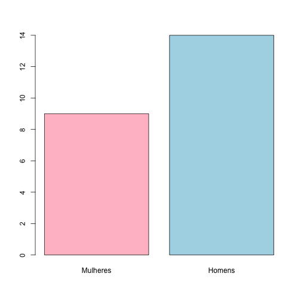


Análise Descritiva
========================================================
- Pode-se definir cores em tonalidades de cinza, usando a função gray(x) 
- **x** é um valor entre 0 e 1 (0 é o preto e 1 é o branco).

Análise Descritiva
========================================================

```r
ident <- c("Mulheres", "Homens")
barplot(prop.table(table(df$sex)) * 100, names.arg = ident, col = c(gray(0.8), gray(0.5)))
title(main = "Frequência relativa - sexo", xlab = "sexo", ylab = "%")
```


Análise Descritiva
========================================================
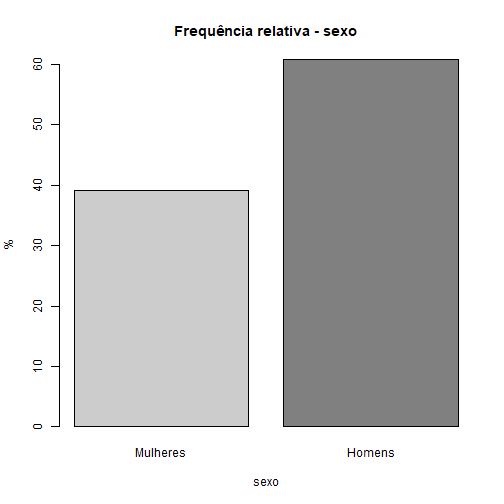

Análise Descritiva
========================================================
- Pode-se utilizar filtros para obter as frequências conjuntas absolutas (e dai as relativas)

```r
sum(df$sex == "f" & df$loc == "at")
```

```
[1] 4
```

```r
sum(df$sex == "m" & df$loc == "at")
```

```
[1] 6
```

```r
sum(df$sex == "f" & df$loc == "cr")
```

```
[1] 4
```

========================================================

```r
sum(df$sex == "f" & df$loc == "cr")
```

```
[1] 4
```

```r
sum(df$sex == "m" & df$loc == "cr")
```

```
[1] 6
```

```r
sum(df$sex == "f" & df$loc == "po")
```

```
[1] 1
```

```r
sum(df$sex == "m" & df$loc == "po")
```

```
[1] 2
```

Análise Descritiva
========================================================
- Para se obter as frequências relativas conjuntas, divide-se os valores de _n<-length(df$sex)_:

```r
table(df$sex, df$loc)
```

```
   
    at cr po
  f  4  4  1
  m  6  6  2
```

```r
prop.table(table(df$sex, df$loc))
```

```
   
            at         cr         po
  f 0.17391304 0.17391304 0.04347826
  m 0.26086957 0.26086957 0.08695652
```

Análise Descritiva
========================================================
- Pode-se alterar o número de digitos significativos usando _options_:

```r
oldoptions <- options()  # preservando as opções existentes
options(digits = 3)
```

Análise Descritiva
========================================================
- As frequências condicionais podem ser obtidas através de _prop.table_. 
- Ex: frequência de homens (m) condicional ao local de trabalho ser Alto Taquari (at):

```r
prop.table(table(df$sex, df$loc), 2)
```

```
   
       at    cr    po
  f 0.400 0.400 0.333
  m 0.600 0.600 0.667
```

Análise Descritiva
========================================================
- Situações envolvendo 3 variáveis (condicional em sexo):

```r
prop.table(table(df$odf, df$loc, df$sex), 3)
```

```
, ,  = f

   
       at    cr    po
  j 0.444 0.222 0.111
  o 0.000 0.222 0.000

, ,  = m

   
       at    cr    po
  j 0.214 0.214 0.000
  o 0.214 0.214 0.143
```

Análise Descritiva
========================================================
- Há recursos para análise e visualização gráfica de frequências conjuntas e condicionais

Análise Descritiva
========================================================

```r
## gráfico de barras justapostas (segunda variável no eixo x) - Frequência
## conjunta absoluta
barplot(table(df$sex, df$loc), beside = TRUE, legend.text = TRUE, args.legend = list(x = 8.8,
              y =5, title = "sexo", horiz = TRUE, cex = 0.8))
title("Frequências conjuntas absolutas\n sexo x localização", xlab = "localização",ylab = "df")
```

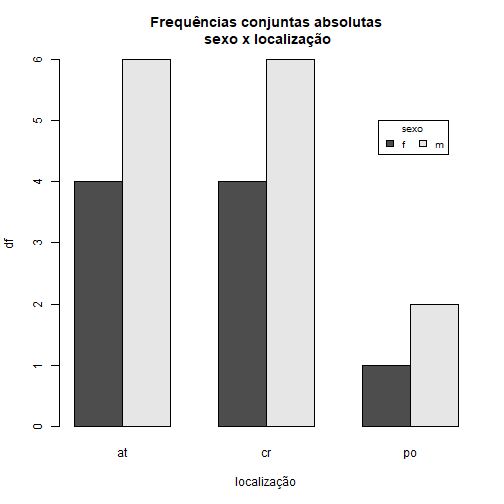

Análise Descritiva
========================================================


Análise Descritiva
========================================================

```r
## gráfico de barras empilhadas (segunda variável no eixo x) - Frequência
## conjunta relativa
barplot(prop.table(table(df$sex, df$loc)) * 100, legend.text = TRUE, 
        xpd = TRUE, args.legend = list(x = "right", title = "sexo", horiz = FALSE, 
                                       inset = -0.07, cex = 0.8))
title("Frequências conjuntas relativas\n sexo x localização", xlab = "localização", 
      ylab = "%")
```


========================================================
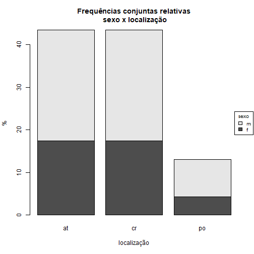

========================================================

```r
## Gráfico de frequência condicional (df$sex|df$loc)
barplot(prop.table(table(df$sex, df$loc), 2) * 100, legend.text = TRUE, 
       xpd = TRUE, ylim = c(0, 100), args.legend = list(x = "right", title = "sexo", 
        horiz = FALSE, inset = -0.07, cex = 0.8))
title("Frequências condicionais relativas\n sexo | localização", xlab = "localização",ylab = "%")
```

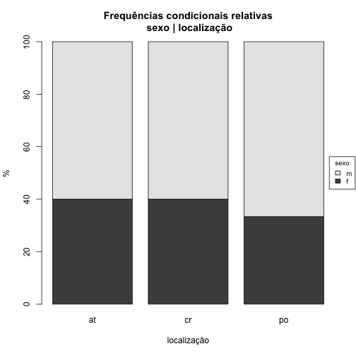

========================================================
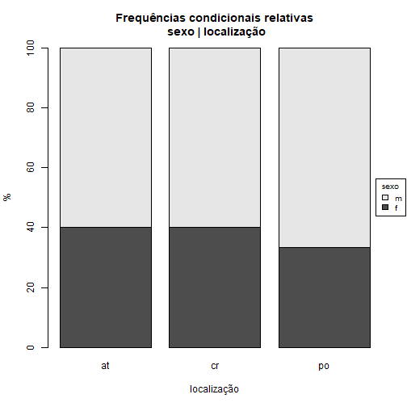


Análise Descritiva
========================================================
- Os próximos exemplos utilizam o gráfico tipo Mosaico do package **vcd**

Análise Descritiva
====

```r
## carregamento do package vcd (deve ser instalado antes)
require(vcd)
```

===
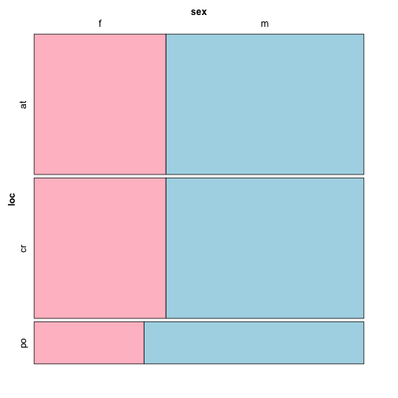

===

```r
## gráfico tipo mosaico - frequências condicionais sexo | localização,
## tipo de ingresso
mosaic(sex ~ loc + odf, data = df, highlighting_fill = c("pink", "lightblue"))
```

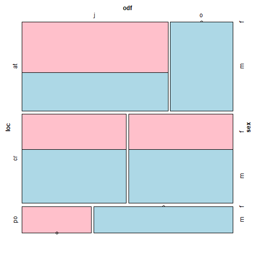

Análise Descritiva
===
- No vcd há gráfico _doubledecker_ para dados de frequências condicionais
- As regiões são proporcionais ao número de pessoas em cada categoria

Análise Descritiva
===

```r
## carregamento do package vcd (deve ser instalado antes)
require(vcd)
## gráfico tipo doubledecker, frequência condicional sexo | localização,
## tipo de ingresso
doubledecker(loc ~ sex + odf, data = df)
```

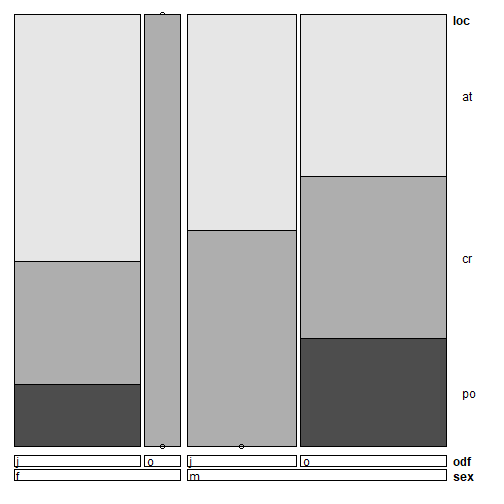

Análise Descritiva
===
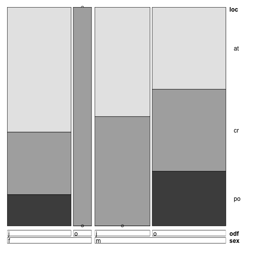

Análise Descritiva
===
- Visualização de variáveis contínuas através de gráficos pode considerar conceitos diferentes 
- Dois são fundamentais: _histograma_ e _boxplot_ (diagrama de Tuckey) 
- Usados na descrição de _variáveis quantitativas_ do levantamento 
  - Examinaremos o índice de massa corporal dos alunos (imc). 
  - O argumento breaks especifica o número de categorias que o histograma irá considerar
  
Análise Descritiva
===

```r
df$imc <- df$pes/df$alt^2
## histograma do peso dos df - básico
hist(df$imc, breaks = 5)
```

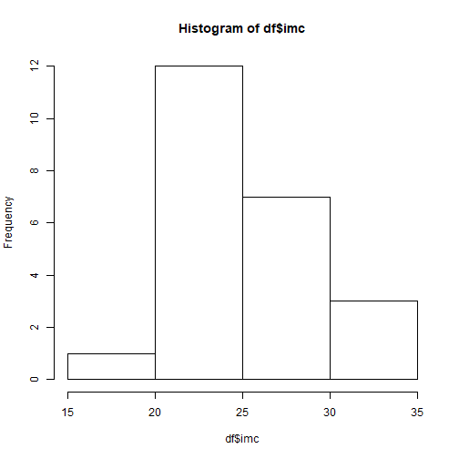

Análise Descritiva
===
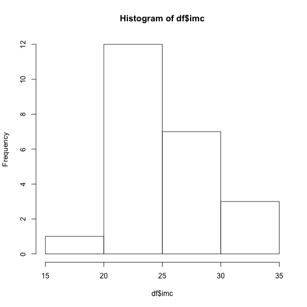

Análise Descritiva
===

```r
## a próxima implementação incorpora algumas opções específicas e deixa o
## número de categorias para o R especificar
hist(df$imc, xlab = "IMC", ylab = "densidade de frequência", main = "Histograma do IMC", 
     col = "bisque", freq = FALSE)
```

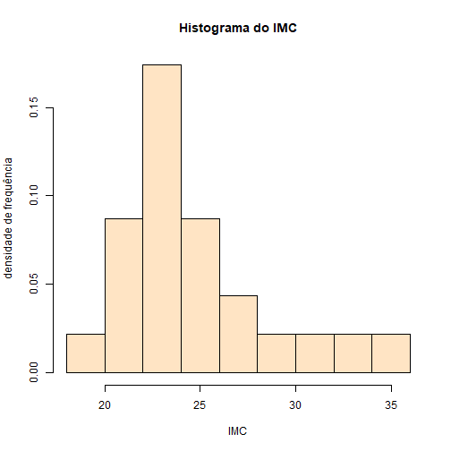

Análise Descritiva
===


Análise Descritiva
===
- Outra opção é **boxplot**
- _Boxplot_ mostra
  - máximo
  - mínimo
  - mediana
  - quartis 25% e 75%. 
- Pode ser um gráfico incondicional ou condicional.

Análise Descritiva
===

```r
boxplot(df$imc)
```

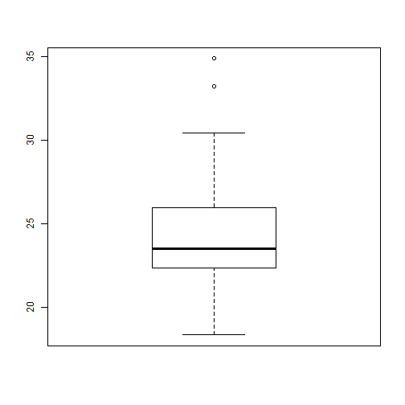

===

```r
boxplot(df$imc ~ df$sex, col = "bisque")
```

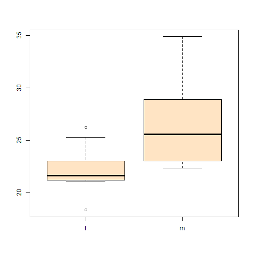


Análise Descritiva
===
- Em muitos casos, há mais de uma informação por resposta
  - Religião, hobbies, livros 
- **_Como tratar essa situação?_**
  - Mais simples: organizar a informação em uma lista que registra a ocorrência de cada caso
  - Pode-se saber o total de pessoas que informou uma dada possibilidade 
- Para essa conversão, usaremos uma _função_ 
  - Converte vetor com respostas distintas divididas por um diferenciador em um vetor com as respostas separadas
  
Análise Descritiva
===
- Definindo a **função**

```r
abrestring <- function(mvec, sep) {
  n <- length(mvec)
  nvec <- list()
  for (i in 1:n) {
    nvec <- list(nvec, strsplit(as.character(mvec[i]), sep))
  }
  nvec <- unlist(nvec)
  return(nvec)
}
```

Análise Descritiva
===
- Usaremos a função para identificar as respostas associadas à informação de hobbies
- Separador é vírgula "',

```r
relhobbies <- abrestring(df$ho1, ", ")
```

===

```r
table(relhobbies)
```

```
relhobbies
                                 Academia 
                                        6 
Acessar internet para buscar conhecimento 
                                       15 
                                  Corrida 
                                        3 
                                  Leitura 
                                        9 
                                   Outras 
                                        9 
                             Ouvir música 
                                       10 
                         Reuniões sociais 
                                        6 
                             Tocar musica 
                                        4 
```

Análise Descritiva
===
- Para religião usaremos:

```r
totrelig <- as.factor(abrestring(df$rel1, ", "))
levels(totrelig) <- c("at", "ca", "es", "ev", "ad", "ou", "pr")
table(totrelig)
```

```
totrelig
at ca es ev ad ou pr 
 1 11  4  4  3  1  1 
```

Análise Descritiva
===
- No caso dos títulos dos livros pode-se utilizar:

```r
livvec <- as.factor(abrestring(df$liv, ";"))
levels(livvec)
```

```
 [1] " Cinquenta Tons de Cinza mais Escuro"                       
 [2] " Diablo III"                                                
 [3] "100 anos de solidão"                                        
 [4] "A cabana"                                                   
 [5] "A Cabana"                                                   
 [6] "A Cilada"                                                   
 [7] "A Cómedia Trágica ou a Tragédia Cômica de Mr. Punch"        
 [8] "A Travessia"                                                
 [9] "ABC da adubação"                                            
[10] "As Esganadas"                                               
[11] "Boas práticas"                                              
[12] "Cana de açúcar"                                             
[13] "Cinquenta Tons de Cinza"                                    
[14] "Cinquenta Tons de Liberdade"                                
[15] "Como conviver com os Outros"                                
[16] "Conhecer Jesus é Tudo"                                      
[17] "Educação pelo trabalho"                                     
[18] "Einstein por Ele Mesmo"                                     
[19] "Equador"                                                    
[20] "Filosofia Sentimental, ensaios de lucidez"                  
[21] "Fortaleza Digital"                                          
[22] "Lugar Nenhum"                                               
[23] "Mandela"                                                    
[24] "Manutenção Mecânica"                                        
[25] "Meninas Normais Vão ao Shopping: Meninas Iradas Vão à Bolsa"
[26] "O Contador de Lágrimas"                                     
[27] "O livro de Ouro da Mitologia"                               
[28] "O Que Steve Jobs Faria"                                     
[29] "O Último Reino"                                             
[30] "O Vendedor de Sonhos, a revolução dos anônimos"             
[31] "Pai Rico Pai Pobre"                                         
[32] "Sementeira de Luz"                                          
[33] "Senhores da Escuridão"                                      
[34] "Sobreviver, crescer e perpetuar"                            
[35] "Sobreviver, Crescer e Perpetuar vol.1"                      
[36] "The Diary of a Wimpy Kid (vol 2,3,4)"                       
[37] "Viva para Contar"                                           
```

 Análise Descritiva
===
- Observa-se que há correções a fazer 
  - espaços, títulos mal-padronizados, letras com caixa diferente
- A correção pode se processar pela substituição dos valores originais por valores padronizados


```r
levels(livvec)[c(1, 2, 4, 8, 34, 35)] <-
  c("Cinquenta Tons de Cinza mais Escuro", 
    "Diablo III", "A Cabana", "A Cabana", "Sobreviver, Crescer e Perpetuar", 
     "Sobreviver, Crescer e Perpetuar")
```

Análise Descritiva
===
- Verificando se está correto:

```r
levels(livvec)
```

```
 [1] "Cinquenta Tons de Cinza mais Escuro"                        
 [2] "Diablo III"                                                 
 [3] "100 anos de solidão"                                        
 [4] "A Cabana"                                                   
 [5] "A Cilada"                                                   
 [6] "A Cómedia Trágica ou a Tragédia Cômica de Mr. Punch"        
 [7] "ABC da adubação"                                            
 [8] "As Esganadas"                                               
 [9] "Boas práticas"                                              
[10] "Cana de açúcar"                                             
[11] "Cinquenta Tons de Cinza"                                    
[12] "Cinquenta Tons de Liberdade"                                
[13] "Como conviver com os Outros"                                
[14] "Conhecer Jesus é Tudo"                                      
[15] "Educação pelo trabalho"                                     
[16] "Einstein por Ele Mesmo"                                     
[17] "Equador"                                                    
[18] "Filosofia Sentimental, ensaios de lucidez"                  
[19] "Fortaleza Digital"                                          
[20] "Lugar Nenhum"                                               
[21] "Mandela"                                                    
[22] "Manutenção Mecânica"                                        
[23] "Meninas Normais Vão ao Shopping: Meninas Iradas Vão à Bolsa"
[24] "O Contador de Lágrimas"                                     
[25] "O livro de Ouro da Mitologia"                               
[26] "O Que Steve Jobs Faria"                                     
[27] "O Último Reino"                                             
[28] "O Vendedor de Sonhos, a revolução dos anônimos"             
[29] "Pai Rico Pai Pobre"                                         
[30] "Sementeira de Luz"                                          
[31] "Senhores da Escuridão"                                      
[32] "Sobreviver, Crescer e Perpetuar"                            
[33] "The Diary of a Wimpy Kid (vol 2,3,4)"                       
[34] "Viva para Contar"                                           
```

Análise Descritiva
===
- Após a reestuturação, frequências absolutas classificadas em ordem decrescente

```r
sort(table(livvec), decreasing = TRUE)
```

```
livvec
                                                   A Cabana 
                                                          3 
                            Sobreviver, Crescer e Perpetuar 
                                                          2 
                        Cinquenta Tons de Cinza mais Escuro 
                                                          1 
                                                 Diablo III 
                                                          1 
                                        100 anos de solidão 
                                                          1 
                                                   A Cilada 
                                                          1 
        A Cómedia Trágica ou a Tragédia Cômica de Mr. Punch 
                                                          1 
                                            ABC da adubação 
                                                          1 
                                               As Esganadas 
                                                          1 
                                              Boas práticas 
                                                          1 
                                             Cana de açúcar 
                                                          1 
                                    Cinquenta Tons de Cinza 
                                                          1 
                                Cinquenta Tons de Liberdade 
                                                          1 
                                Como conviver com os Outros 
                                                          1 
                                      Conhecer Jesus é Tudo 
                                                          1 
                                     Educação pelo trabalho 
                                                          1 
                                     Einstein por Ele Mesmo 
                                                          1 
                                                    Equador 
                                                          1 
                  Filosofia Sentimental, ensaios de lucidez 
                                                          1 
                                          Fortaleza Digital 
                                                          1 
                                               Lugar Nenhum 
                                                          1 
                                                    Mandela 
                                                          1 
                                        Manutenção Mecânica 
                                                          1 
Meninas Normais Vão ao Shopping: Meninas Iradas Vão à Bolsa 
                                                          1 
                                     O Contador de Lágrimas 
                                                          1 
                               O livro de Ouro da Mitologia 
                                                          1 
                                     O Que Steve Jobs Faria 
                                                          1 
                                             O Último Reino 
                                                          1 
             O Vendedor de Sonhos, a revolução dos anônimos 
                                                          1 
                                         Pai Rico Pai Pobre 
                                                          1 
                                          Sementeira de Luz 
                                                          1 
                                      Senhores da Escuridão 
                                                          1 
                       The Diary of a Wimpy Kid (vol 2,3,4) 
                                                          1 
                                           Viva para Contar 
                                                          1 
```

Concluindo
===
### Salvando o data.frame modificado em arquivo no seu computador

- Salvar o _data.frame_ **limpo**, a fim de utilizá-lo em uma futuras análises
- Deve-se gravá-lo em um arquivo externo ao R
- No exemplo, o arquivo a ser salvo terá o nome **ODB2018.csv** 
- Será utilizado o comando **write.table**. 
- O comando _write.table(x, file=...)_ grava o argumento **x** depois de convertê-lo em um _data frame_

Concluindo
===
### Salvando o data.frame modificado em arquivo no seu computador

```r
diretorio <-"../dados/ODB2018.csv" ## Em Windows
#diretorio = "~/Downloads/AED/dados/ODB2018.csv" ## Em MacOsX
# Salvando...
write.table(df, file= diretorio, sep = ";", dec = ",",row.names = FALSE) 
```

Concluindo
===
### Salvando o data.frame modificado em arquivo no seu computador
- Salvo no arquivo “ODB2018.csv”, com opções de um arquivo **csv** 
  - formato **BR** desejado 
  - **“;”** separando os valores 
  - **“,”** separando decimais
  - os nomes das variáveis já compactadas na primeira linha do arquivo 
  - sem nomes identificando linhas (por _default_, a opção _row.names=NA_)
  
Referências
===
Becker, R.A, Chambers, J.M. e Wilks, A.R. (1988), The New S Language: A Programming Environment for Data Analysis and Graphics, Wadsworth & Brooks/Cole.

Becker, R.A.e Chambers, J.M. (1984). S: An Interactive Environment for Data Analysis and Graphics. Wadsworth & Brooks/Cole.

Behrens, John T. (1997), Principles and Procedures of Exploratory Data Analysis, Psychological Methods, Vol. 2, No. 2, pp.131-16.

Cavique, Luís (2014),Big Data e Data Science, Boletim 51.11-14, Repositório Aberto, Universidade Aberta de Portugal.

Hellerstein, Joseph (2008), Quantitative Data Cleaning for Large Databases, EECS Computer Science Division, UC Berkeley.

===
Hornik, Kurt (2017), The R FAQ: Why is R named R?. [Online].  Disponível em:https://cran.r-project.org/doc/FAQ/R-FAQ.html#Why-is-R-named-R_003f, Acessado em: 09/10/2018.

Ihaka,  Ross (1998), R: Past and Future History, Statistics Department, The University of Auckland, Auckland, New Zealand. [Online]. Disponível em:https://cran.r-project.org/doc/html/interface98-paper/paper.html, Acessado em: 09/10/2018.

Janssen, Dale e Janssen, Cory (2018), Proof of Concept (POC), Blog Techopedia - The IT Education Site. [Online]. Disponível em:https://www.techopedia.com/definition/4066/proof-of-concept-poc. Acessado em: 15/10/2018.

Judd, Charles, McCleland, Gary e Ryan, Carey S. (2017). Data Analysis: A Model Comparison Approach To Regression, ANOVA, and Beyond, Third Edition,  Harcourt.

Koomey, Jonathan G. (2006), Best Practices for Understanding Quantitative Data, Research Paper, Visual Business Intelligence Newsletter. Disponível em:http://www.perceptualedge.com/articles/b-eye/quantitative_data.pdf. Acessado em: 09/10/2018.

===
Microsoft Research (2012), Data Cleaning. [Online]. Disponível em:https://www.microsoft.com/en-us/research/project/data-cleaning/?from=http%3A%2F%2Fresearch.microsoft.com%2Fen-us%2Fprojects%2Fdatacleaning%2F. Acessado em: 09/10/2018.

Muenchen, Robert A. (2017), The Popularity of Data Science Software. [Online]. DIsponível em:http://r4stats.com/articles/popularity/. Acessado em: 09/10/2018.

NewGenApps (2017), 6 Reasons: Why Choose R Programming for Data Science Projects? Blog Newgwnapps, Sep 18, 2017. [Online]. Disponível em:https://www.newgenapps.com/blog/6-reasons-why-choose-r-programming-for-data-science-projects. Acessado em: 15/10/2018.

Olavsrud, Thor (2018), Ciência de dados: tudo sobre o método que transforma dados em valor, Computerworld. [Online]. Disponível em:https://computerworld.com.br/2018/07/02/ciencia-de-dados-tudo-sobre-o-metodo-que-transforma-dados-em-valor/. Acessado em: 13/10/2018.

===
O'Neil, Cathy e Schutt, Rachel (2013), Doing Data Science: Straight Talk from the Frontline, O'Reilly Media.

Pinheiro, José Maurício Santos (2010), Prova de Conceito (PoC) no Projeto de Redes de Computadores, Blog Desmonta & CIA. [Online]. DIsponível em:https://desmontacia.wordpress.com/2010/12/21/prova-de-conceito-poc-no-projeto-de-redes-de-computadores/. Acessado em: 15/10/2018.

Plakidasa, Konstantinos, Schallb, Daniel e Zdun, Uwe (2017), Evolution of the R software ecosystem: Metrics, relationships, and their impact on qualities, Journal of Systems and Software, Vol. 132, pp. 119-146.

Profap (2018), Data wrangling: por que o big data depende dessa metodologia? Blog Profap. [Online]. Disponível em:http://profap.com.br/data-wrangling-por-que-o-big-data-depende-dessa-metodologia/. Acessado em: 13/10/2018.

Robinson, David (2017) The Impressive Growth of R, Stack Ovwerflow, Octobe, 10, 2017. [Online]. Disponível em:https://stackoverflow.blog/2017/10/10/impressive-growth-r/. Acessado em: 09/10/2018.

===
Schutt, Rachel e O’Neil, Cathy (2014), Doing Data Science, O’Reilly Media.

Silveira, Debora Pricila (2016), O que é Data Science?, Oficinadanet, 20/07/2016. [Online]. Disponível em:https://www.oficinadanet.com.br/post/16919-o-que-e-data-science. Acessado em: 13/10/2018.

The SunTec India Blog, Clean Data in CRM: The Key to Generate Sales-Ready Leads and Boost Your Revenue Pool (2016). [Online]. Disponível em:https://www.suntecindia.com/blog/clean-data-in-crm-the-key-to-generate-sales-ready-leads-and-boost-your-revenue-pool/. Acessado em: 09/10/2018.

Thieme, Nick (2018), R Generation, Significance Magazine, Royal Ststistics Society, N. 14, August 2018. pp. 14-19.

Tukey, J. (1961) The Future of Data Analysis, Princeton  University. [Online]. Disponível em: https://projecteuclid.org/download/pdf_1/euclid.aoms/1177704711. Acessado em: 09/10/2018.
